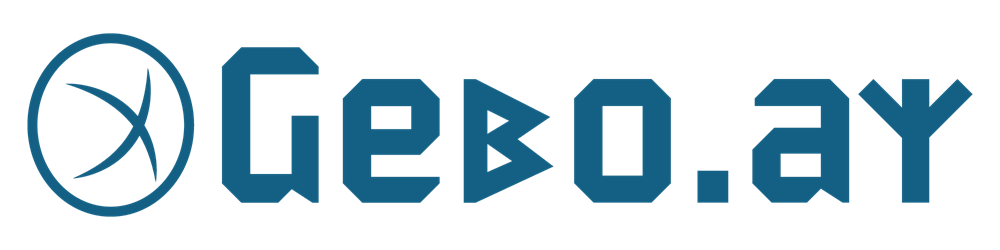

 
# Gebo.ai, The open source Enterprise AI vendor agnostic platform (visit https://gebo.ai)
This software is an open source enterprise AI and retrieve augmented generation platform that can be installed in every company
to take the most out from their documentation and informations using modern large language models.
It's a "No AI vendor lock-in"  alternative to cloud vendors platform, it can work with almost all cloud or on premise AI infrastructures and connects to widely used enterprise systems. 
## Gebo.ai licence:

The open source version is available under a variation of the Mozilla Public License Version 2.0 (MPL-2.0), 
an enterprise version with more feature and support is also available.  
 
 - [Click here to see the licence](./LICENCE.md)
 - [Click here the ORIGIN declaration](./ORIGIN.md) 
 
## Gebo.ai features:
### Administrative features
 The admin, chat,rag chat,graphrag chat user interfaces are **fully multilanguage** and the application is **fully multiuser**.
 All the following features are fully configurable using the administrative user interface.
 - Configure the large language models to use like:
      - **OpenAI** chatgpt
      - **Anthropic** Claude
      - **AWS Bedrock** (Claude, Amazon Nova, Llama, Mistral & more)
      - **Google** Vertex AI / Gemini (experimental, disabled by default)
      - **XaI** Grok
      - **Nvidia** AI provider
      - **Groq**
      - **Deepseek**
      - **MistralAI**
      - **Regolo.ai** (Italian/European)
      - **OpenRouter.ai** (multi-model router)
      - Almost every local large language model using **Ollama** or **vLLM**       
      - Every provider/local server compatible with **OpenAi API**
 - Configure tools & functions that each llm configuration can use, including **web search** (Google or Bing)      
 - Configure additional AI model types besides chat & embedding models:
    - **Image generation** models (OpenAI, AWS Bedrock, Regolo.ai, OpenRouter.ai & OpenAI-compatible providers)
    - **Text to speech** models (OpenAI, AWS Bedrock, Regolo.ai, OpenRouter.ai)
    - **Speech to text / transcription** models (OpenAI, AWS Bedrock, Regolo.ai, OpenRouter.ai)
    - **Reranking** models to improve retrieve augmented generation relevance (AWS Bedrock, Regolo.ai, OpenRouter.ai, vLLM & OpenAI-compatible providers)
 - Most providers support **guided fast-setup** with ready-to-use model presets and automatic models lookup
 - Connect to **Model Context Protocol (MCP)** servers to give your chatbots extra tools & data sources, or expose Gebo.ai itself as an **MCP server**
 - Configure gebo.ai rag system to access several company documents repository and information sharing tools such as:
    - **Microsoft Onedrive/Sharepoint**
    - **Atlassian Confluence**
    - **Atlassian Jira**
    - **Google Workspaces/Drives** 
    - **GitHub/GIT/Bitbucket** or other **git** compatible servers
    - Company shared filesystems
     - **Amazon AWS S3** buckets
     - **WebDAV** compatible servers (Nextcloud, ownCloud, OpenCloud, Pydio Cells, Seafile/SeafDAV, ONLYOFFICE Workspace, Synology DSM WebDAV Server...)
 - Configure **company single sign** on (SSO) using one of the following oauth2 providers:
 	- **Microsoft Entra**
 	- **Google auth**   
 	- **AWS Cognito**
 	- **KeyCloak** (as Generic oauth2)
 - Configure **GraphRag** features (experimental)
 	- The software can use cheap models provided (on premise or in cloud) to export knowledge graphs persisted with neo4j. 	
 - Create knowledge bases collectioning documents from the previus mentioned system.  
 - Schedule document updates for AI reindexing (embedding) on updates.
 - Monitor embedding batch job.
 - Monitor **LLM usage** with built-in dashboards (admin: every user; user: own usage only) — drill down by provider, model, model type (chat/embedding/image/reranking/TTS/transcription), user and month to track calls/tokens over time.
 - Configure company users and groups.      
 - Organize multiple specific Retrieve augmented generation chats for specific company tasks:
    - Examples:
       - Customer support **chatbots to support customer support employees or directly the customers**
       - Tech/Production **productivity chatbots to support employee on mananging internal technical documentation**.
 - Chatbot access can be granted individually to users/groups
 - Knowledge bases can be granted individually to users/groups


### Users features        
 - Chat using chatbots without retrieve augmented generation according to admin config.
 - Chat using chatbots with retrieve augmented generation  according to admin config.
 - Chat with uploaded documents/user documents uploaded in chat session (rag or normal chat sessions).
 - Browse company knowledge bases to select  documents to chat/work with  according to admin config.  
 - Generate **images** directly in chat using configured image generation models.
 - Voice interface (speech to text & text to speech) working with OpenAI provider.   

## How to install Gebo.ai 

You can use docker, docker-compose, download an already configured appliance or install a Ubuntu or windows package, 
visit [https://gebo.ai/downloads/](https://gebo.ai/downloads/)

### Post install configuration procedure:

After you've installed with docker go to http://<your server ip>:12999/ and configure your enterprise rag system account & setup your system.

### What the docker-compose file installs  
The docker-compose file installs the required 
- MongoDB
- Qdrant Vector Database
- Neo4J Graph Database 
- OpenSearch
- geboai/gebo.ai open source version software https://hub.docker.com/r/geboai/gebo.ai  
- An **observability stack** — OpenTelemetry Collector, Prometheus, Tempo and Grafana (pre-provisioned with datasources and a starter dashboard) — see [Observability & monitoring](#observability--monitoring) below

## For devs/software architects/software companies 

This software is build with latest spring boot technologies and the new spring-ai framework, with UI developed in Angular 19+PRIMENG
Is made to accelerate professionals/companies that invested in these technologies to accelerate your own business opportunities 
start building having this as base.

The platform can run either as a single **bootable jar** (monolith) or be deployed as a set of **distributed microservices** (content-handler, brain, vectorizator & graphicator apps) with **Eureka** service discovery and **Hazelcast** clustering for horizontal scalability and high availability.

### Delivery & deployment

| Target | What | Where |
|---|---|---|
| Monolith (single jar) | One bootable Spring Boot fat jar, all controllers in one process | `gebo.apps.parent/gebo.ai.app` |
| Docker Compose microservices | 20 containerized microservices + infra (Mongo, Rabbit, Qdrant, Neo4j, OpenSearch, Eureka, gateway) | `dockers/gebo.microservices/docker-compose.yml` |
| Kubernetes (Helm) | The same microservices stack as Helm charts with per-service install toggles, topology-synced ConfigMaps, and optional in-cluster observability | `deploy/helm/gebo-microservices` |

**Microservices** — the full set of 20+ services (brain, vectorizator, graphicator, chunker, git, filesystem, uploads, userspace, sharepoint, confluence, jira, aws-s3, googledrive, webdav, mcpclient, integration, fulltextor, heimdall, tyr, gateway, eureka) is built with `mvn -P docker,swagger-on clean package jib:buildTar` and deployed via Docker Compose or Helm. Each service exposes its REST surface under a context-path (e.g. `/brain`); per-service Java and Angular client stubs are auto-generated from live OpenAPI specs under `gebo.api.clients/gebo.microservices.clients.parent`.

**Kubernetes / Helm chart** — a production-ready Helm chart at `deploy/helm/gebo-microservices` deploys the entire microservices platform to any Kubernetes cluster. It mirrors the Docker Compose stack and adds:
- **Per-service optional/mandatory install toggles** — disable connectors you don't need (e.g. `graphicator`, `fulltextor`, `jira`); mandatory services (heimdall, brain, tyr, chunker, vectorizator, eureka, gateway) are always rendered.
- **Topology-synced ConfigMaps** — the messaging topology `gebo.microservices.topology` is rendered to match the deployed footprint, so declared topology never drifts from what is deployed.
- **Stateful dependencies** — MongoDB, RabbitMQ, Qdrant, Neo4j, OpenSearch are deployed in-cluster by default, or pointed at external/managed instances.
- **Optional observability** — OpenTelemetry collector, Tempo (traces), Prometheus (metrics), and Grafana (dashboards) can be enabled with `observability.enabled: true`.

```bash
helm install gebo deploy/helm/gebo-microservices \
  --namespace gebo --create-namespace \
  --set image.registry=myregistry.example.com/ \
  --set image.tag=1.0.2.1-SNAPSHOT
```

### Observability & monitoring

Every service (the monolith and each microservice) ships with **Micrometer** + **Spring Boot Actuator**, built once in the shared `gebo.architecture.telemetry` module and pulled in by every starter (`gebo.apps.monolithic.starter`, `gebo.microservices.starter`, `gateway.gebo.ai`):
- `micrometer-registry-prometheus` exposes `/actuator/prometheus` metrics (JVM, HTTP, message-broker routing rate/latency).
- `micrometer-tracing-bridge-otel` + `opentelemetry-exporter-otlp` export distributed traces (including message-broker hops) over OTLP.

**Docker Compose** — both `dockers/gebo.ai/docker-compose.yml` (monolith) and `dockers/gebo.microservices/docker-compose.yml` bundle the full stack out of the box: an `otel-collector`, `prometheus` (scraping every service's `/actuator/prometheus`), `tempo` (trace storage) and `grafana` — provisioned with Prometheus/Tempo datasources and a starter "Gebo overview" dashboard (services up, HTTP request rate/latency, message-broker throughput, JVM memory). Reach it at `http://<host>:3000` after `docker compose up`.

**Kubernetes / Helm** — the same stack is available as an opt-in add-on (`observability.enabled: true`), see [deploy/helm/gebo-microservices/README.md](./deploy/helm/gebo-microservices/README.md#observability-optional).

**LLM usage dashboards** — independent of the infra metrics above, Gebo.ai also tracks per-call LLM usage (tokens, provider, model, model type, calling module, user) and exposes it through dedicated admin/user REST APIs and Angular dashboards — see [Administrative features](#geboai-features) above.

### How to build the software:

- Use Maven 3.8+
- Use JDK 20+ 
- Run "mvn clean package -P bootables,angular-ui" 
- The Bootable jar file will be generated in:   /gebo.ai.app/target 

### Environment variables to run the software:

To run the software uoy have to put 2 variables in your environment (with set on windows and export on bash/linux) 
 - GEBO_HOME ==> it points to the home directory the software it uses to allocate its own 
 - GEBO_WORK_DIRECTORY ==> it points to a local filesystem area that the software uses to archive informations/files (please back it up)
 
       
