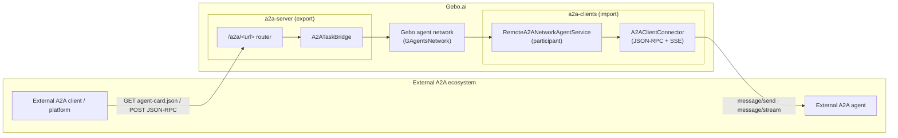
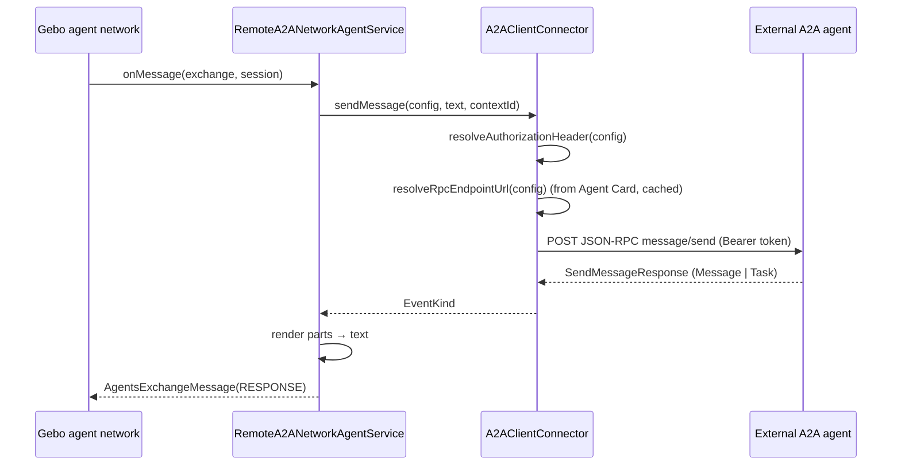
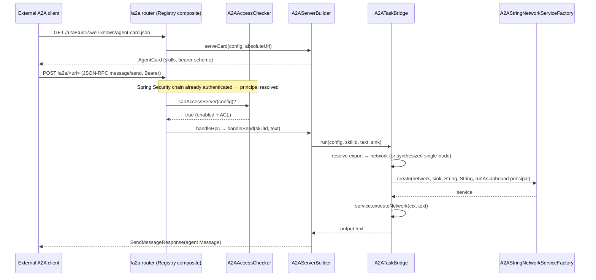

# Gebo.ai — A2A (Agent2Agent) Implementation Architecture

> **Audience:** this document is written to be read by both humans and coding agents.
> It reflects the **implementation as built** (not a plan). Section headings are stable,
> class/file paths are exact and clickable, and the machine-readable **Fact Sheet** and
> **File Index** let an agent locate any component without re-scanning the tree.
>
> **Companion document:** [`A2A-PROTOCOL-INTEGRATION-PLAN.md`](./A2A-PROTOCOL-INTEGRATION-PLAN.md)
> is the original design rationale. This document supersedes it for "how it actually works".

---

## 1. Fact Sheet (machine-readable)

| Key | Value |
| --- | --- |
| Protocol | [Agent2Agent (A2A)](https://a2aproject.github.io/A2A/) — Agent Card + JSON-RPC 2.0 over HTTP(S), SSE for `message/stream` |
| SDK | `org.a2aproject.sdk:a2a-java-sdk-jsonrpc-common` (wire types + `JsonUtil` Gson), version `1.3.0.Final` (property `a2a.sdk.version`; the SDK BOM is deliberately **not** imported) |
| Directions | **Import** (call external A2A agents) and **Export** (publish Gebo agents/networks as A2A agents) |
| Client module | `gebo.architecture.parent/gebo.architecture.a2a-clients` |
| Server module | `gebo.architecture.parent/gebo.architecture.a2a-server` |
| Persistence | MongoDB via Spring Data (`GBaseObject` + repositories) |
| Inbound endpoint | `POST /a2a/<exportedRelativeUrl>` (JSON-RPC) + `GET /a2a/<exportedRelativeUrl>/.well-known/agent-card.json` |
| Admin API (import) | `api/admin/A2AClientConfigController/*` (role `ADMIN`) |
| Admin API (export) | `api/admin/GeboA2AServerAdminController/*` (role `ADMIN`) |
| Transport (impl) | JDK `java.net.http.HttpClient`, pinned HTTP/1.1 (no Vert.x/gRPC/Reactor-Netty pulled in) |
| Secure by default | Every import/export is admin-created, `enabled=false` by default, and never externally visible until switched on |
| Identity model | Inbound authenticated by the platform Spring Security chain → exported network runs impersonating that principal; outbound relays the caller's identity via token exchange when no service secret is set |
| Wired into | `gebo.apps.monolithic.starter` (monolith) and `brain.gebo.ai` (microservice) |
| Agent-network execution | `IGAgentsNetworkServiceFactory.create(...).executeNetwork()` via the text-typed `A2AStringNetworkService` (factory id `A2A_STRING_NETWORK`) |

---

## 2. Overview

Gebo.ai speaks A2A in **both directions**, reusing the exact architectural patterns already
proven by the MCP client/server modules (`mcp-clients` / `mcp-server`):

- **Import side (`a2a-clients`)** — an admin registers an external A2A agent (any framework/vendor).
  It is persisted in Mongo and, once enabled, mounted into the agents runtime as an ordinary
  `String → String` network participant. Gebo agent networks can then call it like a local agent.

- **Export side (`a2a-server`)** — an admin publishes a Gebo **single agent** *or an entire
  network of agents* as one opaque, standards-compliant A2A agent, with its own Agent Card and a
  JSON-RPC endpoint. External A2A clients consume it without knowing what is behind it.

Both sides are **secure by default**: nothing is reachable until an admin creates the config,
selects what to expose/consume, and sets `enabled = true`.

---

## 3. Module map

| Module | Responsibility | Key packages |
| --- | --- | --- |
| `gebo.architecture.a2a-clients` | Import: register/persist external A2A agents, discover their Agent Card, mount them as network participants, and speak the client transport | `model`, `repository`, `service(.impl)`, `config`, `controllers` |
| `gebo.architecture.a2a-server` | Export: persist published endpoints, build the Agent Card, serve JSON-RPC (`message/send`/`message/stream`), and run the exported network/agent | `model`, `repository`, `runtime`, `service(.impl)`, `controllers` |

Both depend only on `a2a-java-sdk-jsonrpc-common` (spec wire types) — the SDK's client/server
transports and their Vert.x/gRPC/Reactor-Netty stacks are intentionally excluded; Gebo provides
its own transport over the JDK HTTP client and Spring MVC functional routing.

---

## 4. Persistence / data model

All persisted entities extend `GBaseObject` and implement `IGObjectWithSecurity` +
`IAclGrantedResource`, so they get the platform's ownership stamping and ACL contract for free.

### 4.1 `A2ARemoteAgentConfig` (import) — one registered external agent

`gebo.architecture.a2a-clients/.../model/A2ARemoteAgentConfig.java`

| Field | Type | Meaning |
| --- | --- | --- |
| `agentCardUrl` | `String` (**required**) | The **single discovery input**: full URL of the remote Agent Card (e.g. `https://host:port/.well-known/agent-card.json`). The card is fetched here and the JSON-RPC endpoint is taken from its body. |
| `rpcEndpoint` | `String` (optional) | Override of the JSON-RPC endpoint. Left null → use the endpoint from the card (A2A standard). Absolute, or relative to the card URL's origin. |
| `transportType` | `A2ATransportType` | `JSONRPC` (wired). `REST`/`GRPC` reserved, rejected until implemented. |
| `authMode` | `A2AAuthMode` | Outbound auth mode — see [§7](#7-security-model). |
| `secretCode` | `String` | Points to a `GeboSecret` (API key / bearer / stored OAuth2 token) resolved via `IGeboSecretsAccessService`. |
| `oauth2AuthenticatorCode` | `String` | Points to an OAuth2 runtime config for client-credentials mode. |
| `exportingPrefix` | `String` (**required**) | Prefix used to derive the local runtime service id, keeping remote ids from colliding with local ones. |
| `enabled` | `Boolean` (default null/false) | Off by default; only when true is the agent mounted as a runnable participant. |
| `skills` | `List<A2ARemoteSkill>` | Skills discovered from the card (populated by `testAndDiscovery`). |
| ACL fields | `accessibleToAll`, `accessibleUsers`, `accessibleGroups`, `aclAliases` | Who may execute this agent. |

### 4.2 `A2ARemoteSkill` — discovered skill (with diff bookkeeping)

`.../model/A2ARemoteSkill.java` — `id` (match key), `name`, `description`, `tags`,
`inputModes`, `outputModes`, plus discovery flags `addedOnRemote` / `deletedOnRemote` set by the
skill diff during `testAndDiscovery`.

### 4.3 `A2AServerConfig` (export) — one published endpoint

`gebo.architecture.a2a-server/.../model/A2AServerConfig.java`

| Field | Type | Meaning |
| --- | --- | --- |
| `exportedRelativeUrl` | `String` (**required**) | Unique URL segment; the endpoint is served under `/a2a/<exportedRelativeUrl>`. |
| `enabled` | `Boolean` | When false/null the endpoint is not published. |
| `exportedAgents` | `List<A2AExportedAgent>` | The agents/networks exposed through this endpoint. |
| `securitySchemeName` | `String` | Reflects the platform's active auth mode on the card. *(Advisory only; actual validation is done by the Spring Security chain. Currently not consumed by the card builder.)* |
| ACL fields | as above | Who may call the endpoint (checked against the resolved inbound principal). |

### 4.4 `A2AExportedAgent` — one export entry

`.../model/A2AExportedAgent.java`

| Field | Meaning |
| --- | --- |
| `kind` | `AGENT` or `NETWORK` (default `NETWORK`). |
| `networkCode` | For `NETWORK`: the network code, resolved via `IAgentsNetworkDao` (works for both Mongo-persisted and code-generated networks). |
| `agentConfigCode` | For `AGENT`: the agent config wrapped in a synthesized single-node network. |
| `skillName` | The A2A skill id/name advertised on the card and used to route inbound calls. |
| `exposeMemberCapabilities` | When true, fold member agents' capabilities into the skill for richer discovery. Default false keeps the network **opaque** (members never individually reachable). |

### 4.5 Enums

- `A2ATransportType` — `JSONRPC` (wired), `REST`, `GRPC` (reserved).
- `A2AAuthMode` — `NONE`, `API_KEY`, `STATIC_BEARER_TOKEN`, `OAUTH2_CLIENT_CREDENTIALS`,
  `OAUTH2_AUTHORIZATION_CODE_PER_USER`, `USER_TOKEN_RELAY`, `TOKEN_EXCHANGE`.

---

## 5. Import (client) architecture

### 5.1 Discovery — `testAndDiscovery`

`A2AClientManagementServiceImpl.testAndDiscovery(config)` validates the connection config, then
`A2AClientConnector.fetchAgentCard(config)` does a plain authenticated HTTP `GET` of
`agentCardUrl` and parses it with the SDK's `JsonUtil` into an `AgentCard`. The advertised skills
are diffed against the stored ones by skill `id` (`addedOnRemote` / `deletedOnRemote` flags) and
cached on the config. No connectivity is required to *register* an agent — only to discover it.

### 5.2 Runtime mounting — the two-bean dynamic pattern

`config/A2AClientsRuntimeConfig.java` exposes the **same two beans** the standard agents module
uses for dynamic agents, both reading the repository fresh on every call and both **skipping
disabled configs**:

- `IGDynamicAgentServiceSupplier` → one `RemoteA2ANetworkAgentService` per enabled config.
- `IGDynamicAgentConfigDataSource` → the matching `GAgentConfig` (carrying the remote agent's
  ACLs so `filterCanDoAction` gates execution the same way).

The two are paired by **`agentServiceId`**, computed by the single source of truth
`A2ARemoteServiceIds.serviceId(config)` = `"a2a:" + (exportingPrefix | code)`.

### 5.3 The participant — `RemoteA2ANetworkAgentService`

`service/impl/RemoteA2ANetworkAgentService.java` implements `IGNetworkAgentService<String,String>`
(it deliberately does **not** extend the LLM-invoking base — it is a thin bridge). Its
`onMessage(...)` takes the inbound `AgentsExchangeMessage`, calls
`connector.sendMessage(remoteConfig, inputText, session.getId())`, renders the returned A2A
`EventKind` (`Message` → its text parts; `Task` → artifacts / status message / last history entry)
back to text, and returns a single `RESPONSE` exchange message. `getAgentCapabilities(...)`
projects the cached remote skills into `AgentCapabilities` so the network planner can reason about
them.

### 5.4 Transport — `A2AClientConnector`

`service/impl/A2AClientConnector.java`

- **HTTP client:** JDK `HttpClient`, pinned `HTTP/1.1` (avoids the h2c-upgrade handshake failures
  and keeps the SDK's heavier transports out of the classpath).
- **`message/send`** — builds a `SendMessageRequest` (SDK wrapper), POSTs JSON, parses
  `SendMessageResponse`, throws on a JSON-RPC error, returns the result `EventKind`.
- **`message/stream`** — POSTs a `SendStreamingMessageRequest` with `Accept: text/event-stream`,
  consumes SSE `data:` lines on a bounded-elastic scheduler, and emits each
  `SendStreamingMessageResponse.result` as a `Flux<StreamingEventKind>`.
- **Endpoint resolution** — `resolveRpcEndpointUrl(config)`: a non-blank `rpcEndpoint` override
  wins (absolute, or resolved against the card URL's origin); otherwise the endpoint is taken from
  the fetched card (`jsonRpcEndpointFromCard`: preferred-transport `url`, else a JSONRPC entry in
  supported/additional interfaces, else the card `url`, else the origin). Resolved values are
  cached per `agentCardUrl` with a 10-minute TTL.

### 5.5 Import sequence

---

## 6. Export (server) architecture

### 6.1 Live endpoint registry (runtime updates, no restart)

- `A2ADispatcherConfig` registers **one** delegating `RouterFunction` bean. Spring collects router
  beans once at startup, so on every request this bean consults
  `A2AServerRegistry.currentComposite()`.
- `A2AServerRegistry` owns a `Map<code, A2AServerInstance>` and a `volatile` composite router. It
  builds instances for servable configs at `@PostConstruct` and rebuilds the composite on every
  `reload(code)` / `remove(code)` — so endpoints can be added/updated/removed at runtime.
  `isServable` = `enabled == true` && non-blank `exportedRelativeUrl`.
- `A2AServerBuilder.build(config)` produces the `A2AServerInstance` router:
  `GET <base>/.well-known/agent-card.json` → serve card; `POST <base>` → JSON-RPC; both wrapped in
  an access filter returning **403** when `A2AAccessChecker.canAccessServer(config)` is false
  (`base = /a2a/<exportedRelativeUrl>`).

### 6.2 Agent Card — `A2AAgentCardBuilder`

`runtime/A2AAgentCardBuilder.java` builds the `AgentCard` served at the well-known path: one
`AgentSkill` per exported entry. A `NETWORK` skill is derived from the network's
`scenarioDescription` (opaque; member capabilities folded in only when `exposeMemberCapabilities`);
an `AGENT` skill from the agent service's `getAgentCapabilities(...)`. The card advertises
`preferredTransport = JSONRPC`, `streaming = true`, and a single HTTP **bearer** security scheme
(`HTTPAuthSecurityScheme` `scheme=bearer, bearerFormat=JWT`) + a matching `SecurityRequirement`,
because both platform auth modes present a bearer token that the security chain validates.

### 6.3 JSON-RPC handling — `A2AServerBuilder`

`handleRpc` reads the raw body, extracts `method`, and parses into a `SendMessageRequest`
(both send and stream carry `MessageSendParams` + id). It renders the inbound message's text parts,
reads `contextId`, and extracts the target `skillId` from the message metadata (`metadata.skillId`).

- `message/send` → `handleSend` runs the bridge synchronously and returns a `SendMessageResponse`
  wrapping an agent `Message`.
- `message/stream` → `handleStream` runs synchronously and emits the result as a **single terminal
  SSE frame** (`SendStreamingMessageResponse`). The SSE transport contract is honoured; live
  partial streaming of agent progress is a planned follow-up.
- Unknown method → JSON-RPC error `-32601`; execution failure → `-32603`.
- Serialization uses the SDK's Gson (`JsonUtil`), **not** Spring's Jackson.

### 6.4 Execution seam — `A2ATaskBridge`

`runtime/A2ATaskBridge.java` is the heart of the export side:

1. `resolveExport(serverConfig, skillId)` — match the export entry by `skillName`, falling back to
   the underlying network/agent code.
2. `resolveNetwork(exported)`:
   - `NETWORK` → `IAgentsNetworkDao.findByCode(networkCode)` (works for Mongo or code-generated
     networks).
   - `AGENT` → `synthesizeSingleNodeNetwork(agentConfigCode)` — an ephemeral `GAgentsNetwork` with
     the agent as both input and output node, factory id `A2A_STRING_NETWORK`, `maxLoopIteration=2`.
     (A single agent has no standalone run path; the single-node network is how it executes.)
3. Capture the inbound identity with `ReactiveIdentityUtil.create()`.
4. Get the `A2AStringNetworkServiceFactory` from `IGAgentsNetworkServiceFactoryRepositoryPattern`,
   `factory.create(network, sink, String, String, runAs)`, then `service.executeNetwork(ctx, input, {})`.
5. Return the produced text; `dispose()` in a `finally`.

Both export kinds therefore go through the **one proven path**
`IGAgentsNetworkServiceFactory.create(...).executeNetwork()`, run **impersonating the inbound
principal** (`runAs`), honouring that principal's ACLs.

### 6.5 Why a dedicated string network service

`A2AStringNetworkService` / `A2AStringNetworkServiceFactory` (`FACTORY_ID = "A2A_STRING_NETWORK"`)
are the **text-I/O counterpart** of the chat network service. The only registered network service
before A2A was chat-typed (`ChatPipelineExecutionRuntimeData → GeboChatMessageEnvelope`), so
running a network with plain-text A2A messages needed a `String → String` service. It extends
`GAbstractReactiveOutputAgentsNetworkService`; `compose()` keeps the latest non-null output as the
final result. Progress notifications during a synchronous `message/send` are gathered by
`A2ANotificationCollector` (an in-memory `INotificationSink`).

### 6.6 Export sequence

---

## 7. Security model

The design goal is **coherent identity end-to-end**: an inbound A2A call impersonates the
resolved local principal, and an outbound A2A call can relay the caller's own identity — so a Gebo
network exported over A2A and consumed by another Gebo instance runs as the original user.

### 7.1 Inbound (export side)

- `/a2a/**` is authenticated by the platform Spring Security chain
  (`GeboAISecurityConfig`, `a2aUrls`), requiring authority `USER`, `ADMIN`, or `APPLICATION`. The
  inbound credential (self-issued JWT / API key, or an OAuth2 resource-server token) establishes
  the **local principal**.
- `A2AAccessChecker.canAccessServer(config)` rejects disabled configs and enforces the config's
  ACL (`READ` + `EXECUTE`); admins bypass the ACL.
- `A2ATaskBridge` runs the exported network with `ReactiveIdentityUtil.create()` → the network
  executes **as that principal**, so every downstream tool/KB/agent honours the principal's ACLs.

### 7.2 Outbound (import side) — `A2AAuthMode`

`A2AClientConnector.resolveAuthorizationHeader(config)`:

| Mode | Behaviour |
| --- | --- |
| `NONE` | No `Authorization` header. |
| `API_KEY` / `STATIC_BEARER_TOKEN` | `Bearer <secret>` from `secretCode` via `IGeboSecretsAccessService`. |
| `OAUTH2_CLIENT_CREDENTIALS` | `Bearer <token>` minted from the `oauth2AuthenticatorCode` runtime config (`tokenUri` + `clientSecretId`) via `IGOauth2AccessTokenService`. |
| `OAUTH2_AUTHORIZATION_CODE_PER_USER` / `USER_TOKEN_RELAY` | If `secretCode` is set → relay the stored authorized-client token; **if `secretCode` is blank → token exchange** (relay the caller's live identity). |
| `TOKEN_EXCHANGE` | Always relay the caller's live identity. |

### 7.3 Token exchange — `exchangeCurrentUserToken()`

The relay mechanism follows the platform's **active** auth mode:

| Platform mode (`GeboSecurityConfig.oauth2ResourceServerEnabled`) | Relayed token |
| --- | --- |
| **OAuth2 resource-server** | The **actual inbound OAuth2 bearer token** the user authenticated with, extracted from `AbstractOAuth2TokenAuthenticationToken.getToken().getTokenValue()` (covers JWT and opaque tokens). The platform is not the issuer, so the original token is passed through as-is. |
| **Self-issued JWT / API-key** | A fresh short-lived JWT (5-minute TTL) minted for the current user via `LocalJwtTokenProvider.createToken(...)` — the same primitive the API-key mechanism uses. |

Because the calling network runs under the invoking user's `runAs`, the security context here is
that user; a receiving Gebo A2A server validates the token through the same chain and runs the
exported network impersonating the same user. **Credentials are never handled in clear text by
callers** — they come from the platform secrets vault or the live security context.

---

## 8. Admin REST API surface

### 8.1 Import — `api/admin/A2AClientConfigController` (role `ADMIN`)

| Method | Path | Purpose |
| --- | --- | --- |
| POST | `testAndDiscovery` | Fetch the Agent Card, diff & return discovered skills. |
| POST | `insertA2AAgent` | Register a new remote agent. |
| POST | `updateA2AAgent` | Update an existing one. |
| DELETE | `deleteA2AAgent` | Remove one. |
| GET | `findByCode?code=` | Fetch one. |
| GET | `list?page=&size=` | Paged list. |

### 8.2 Export — `api/admin/GeboA2AServerAdminController` (role `ADMIN`)

| Method | Path | Purpose |
| --- | --- | --- |
| GET | `findAll` | All published server configs. |
| GET | `findByCode?code=` | Fetch one. |
| POST | `insertA2AServer` | Create a published endpoint. |
| POST | `updateA2AServer` | Update it (registry re-syncs the live endpoint). |
| DELETE | `deleteA2AServer?code=` | Delete it (endpoint removed live). |

Both controllers return the platform's standard `OperationStatus<T>` envelope. Java and Angular
client stubs are auto-generated from the live OpenAPI spec (regenerate after any model/controller
change).

---

## 9. Admin UI

`gebo.ui/projects/gebo-ai-admin-ui/src/lib`:

- **Import editor** `admin-ui/entity-editors/gebo-ai-a2a-client-admin/` — connection (single
  **Agent Card URL** field + optional JSON-RPC override), transport, auth mode with
  conditional credential fields, discovered-skills table, ACLs. Uses the generated
  `A2AClientConfigControllerService`.
- **Export editor** `admin-ui/entity-editors/gebo-ai-a2a-server-admin/` — `exportedRelativeUrl`,
  the exported-agents table (AGENT/NETWORK), ACLs, and a read-only note that inbound auth is
  handled by the platform security chain.
- **Setup wizards** `setup-wizard/a2a-import-wizard.*` and `a2a-export-wizard.*` — setup-area
  screens listing registered/published entries and opening the editors.
- Registered via `GEBO_UI_ENTITY_FORM_TOKEN` (for `A2ARemoteAgentConfig` / `A2AServerConfig`) and
  `WIZARD_SECTION` in the admin & setup-wizard modules.

---

## 10. Wiring & packaging

- Modules registered in `gebo.architecture.parent/pom.xml`.
- Both modules depend on `a2a-java-sdk-jsonrpc-common` with the version **pinned per module** via
  `${a2a.sdk.version}`. The SDK BOM is deliberately **not** imported (it test-scopes JUnit, which
  breaks `gebo.architecture.integration.tests`).
- Wired into the runtime by both:
  - `gebo.apps.parent/gebo.apps.monolithic.starter` (the monolith), and
  - `gebo.apps.parent/gebo.microservices.apps.parent/brain.gebo.ai` (the `brain` microservice).
- Controllers are picked up by component scan (`@RestController`), so they appear on every service
  that includes the modules.

---

## 11. Known limitations & planned follow-ups

| Area | Current state | Planned |
| --- | --- | --- |
| `message/stream` | Runs synchronously, emits one terminal SSE frame (transport contract honoured) | Live partial streaming of agent progress |
| Task lifecycle | `message/send` returns a terminal result; inbound `Task` results are rendered | `tasks/get`, `tasks/cancel`, durable/resumable tasks |
| Transports | `JSONRPC` only | `REST`, `GRPC` (enum reserved) |
| `A2AServerConfig.securitySchemeName` | Persisted, advisory | Either consume it in the card builder or remove it (needs stub regen) |
| Push notifications | Card advertises `pushNotifications=false` | Optional webhook push |

---

## 12. Testing

- **Connector unit test** — `a2a-clients/src/test/.../A2AClientConnectorIntegrationTest.java`:
  a JDK `HttpServer` mock serves an Agent Card and echoes `message/send`; verifies card fetch/parse
  and a well-formed send + reply, exercising card-derived endpoint resolution.
- **Grounded integration test** — `integration-tests/a2a-integration-tests/.../A2AExportImportIntegrationTest.java`:
  extends the fake-LLMS monolith test base (`AbstractVendorSetupAndUseTest`), `@SpringBootTest`
  random port, self-registers an admin, exercises export registration and import discovery against
  a mock JDK `HttpServer` peer. Drives the backend through the generated `ai.gebo.monolithic.api.client`.

---

## 13. File Index (machine-readable)

### a2a-clients (`gebo.architecture.parent/gebo.architecture.a2a-clients/src/main/java/ai/gebo/architecture/a2aclients/`)

| Path (relative to package root) | Role |
| --- | --- |
| `model/A2ARemoteAgentConfig.java` | Persisted remote-agent registration |
| `model/A2ARemoteSkill.java` | Discovered skill + diff flags |
| `model/A2ATransportType.java` | Transport enum |
| `model/A2AAuthMode.java` | Outbound auth-mode enum |
| `repository/A2ARemoteAgentConfigRepository.java` | Mongo repository |
| `service/A2AClientManagementService.java` | Management service interface |
| `service/impl/A2AClientManagementServiceImpl.java` | CRUD + `testAndDiscovery` + skill diff |
| `service/impl/A2AClientConnector.java` | JSON-RPC/SSE transport + auth + endpoint resolution |
| `service/impl/RemoteA2ANetworkAgentService.java` | `IGNetworkAgentService` participant bridge |
| `service/impl/A2ARemoteServiceIds.java` | `agentServiceId` derivation (single source of truth) |
| `config/A2AClientsRuntimeConfig.java` | Dynamic supplier + config data source beans |
| `controllers/A2AClientConfigController.java` | Admin REST controller |

### a2a-server (`gebo.architecture.parent/gebo.architecture.a2a-server/src/main/java/ai/gebo/architecture/a2aserver/`)

| Path (relative to package root) | Role |
| --- | --- |
| `model/A2AServerConfig.java` | Persisted published endpoint |
| `model/A2AExportedAgent.java` | One export entry (AGENT/NETWORK) |
| `repository/A2AServerConfigRepository.java` | Mongo repository |
| `runtime/A2AServerRegistry.java` | Live endpoint registry + composite router |
| `runtime/A2AServerInstance.java` | One built endpoint (config + router) |
| `runtime/A2AServerBuilder.java` | Router: card route + JSON-RPC (send/stream) + 403 filter |
| `runtime/A2ADispatcherConfig.java` | Single delegating router bean |
| `runtime/A2AAgentCardBuilder.java` | Agent Card projection (skills, bearer scheme) |
| `runtime/A2ATaskBridge.java` | Resolve export → run network under `runAs` |
| `runtime/A2AStringNetworkService.java` | `String → String` network service |
| `runtime/A2AStringNetworkServiceFactory.java` | Its factory (`A2A_STRING_NETWORK`) |
| `runtime/A2ANotificationCollector.java` | In-memory notification sink |
| `runtime/A2AAccessChecker.java` | Inbound ACL/enabled decision |
| `service/A2AServerConfigManagerService.java` | Management service interface |
| `service/impl/A2AServerConfigManagerServiceImpl.java` | CRUD + registry sync |
| `controllers/GeboA2AServerAdminController.java` | Admin REST controller |

### Cross-cutting

| Path | Role |
| --- | --- |
| `gebo.architecture.parent/gebo.architecture.security/.../config/GeboAISecurityConfig.java` | `/a2a/**` authenticated (authority USER/ADMIN/APPLICATION) |
| `gebo.apps.parent/gebo.apps.monolithic.starter/pom.xml` | Wires both modules into the monolith |
| `gebo.apps.parent/gebo.microservices.apps.parent/brain.gebo.ai/pom.xml` | Wires both modules into `brain` |
| `pom.xml` (root) | `a2a.sdk.version = 1.3.0.Final` |

---

## 14. Glossary

- **Agent Card** — the JSON descriptor an A2A agent publishes at
  `/.well-known/agent-card.json`, listing skills, transport, and security schemes.
- **Skill** — a named capability on an Agent Card; on the export side each `A2AExportedAgent`
  becomes one opaque skill.
- **Opaque agent/network** — an exported network published as a single skill whose internal member
  agents are not individually reachable (unless `exposeMemberCapabilities`).
- **Impersonation / `runAs`** — running an agent network under a captured Spring Security identity
  (`ReactiveIdentityUtil`) so all ACL checks apply to that principal.
- **Token exchange / relay** — sending the caller's own identity (relayed OAuth2 token or minted
  short-lived JWT) to a remote A2A agent instead of a static service credential.
