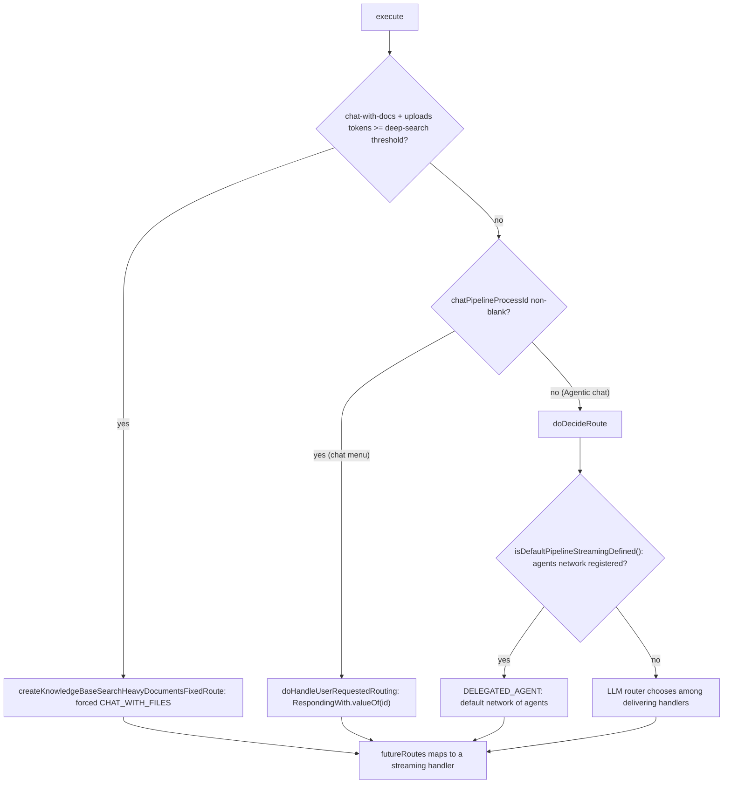

# Gebo.ai — Default Chat Pipeline Routing Architecture

> **Audience:** this document is written to be read by both humans and coding agents.
> It reflects the **implementation as built** (not a plan). Class/file paths are exact
> and clickable, and the machine-readable **Fact Sheet**, **Route Table** and
> **File Index** let an agent answer "how does a request reach an output handler?"
> without re-scanning the tree.
>
> **Read this before changing anything in `DefaultRoutingChatPipelineStepServiceImpl`.**
> Section 7 lists the invariants that are easy to get wrong.

---

## 1. Fact Sheet (machine-readable)

| Key | Value |
| --- | --- |
| Module | `gebo.architecture.parent/gebo.architecture.chat.abstraction.layer` |
| Pipeline id | `default-pipeline` (`ChatPipelinesConfiguration.DEFAULT_PIPELINE`) |
| Input step | `default-input-step` — `DefaultInputChatPipelineStepServiceImpl` |
| Router step | `default-routing-step` — `DefaultRoutingChatPipelineStepServiceImpl` |
| Entry point | `DefaultRoutingChatPipelineStepServiceImpl.execute(..)` |
| Selector field | `GeboTemplatedChatRequest.chatPipelineProcessId` (`String`, nullable) |
| Selector semantics | **blank/null = "Agentic chat"**; non-blank = the literal name of a `RespondingWith` value |
| Handler enum | `RespondingWith` (8 values, see §5) |
| Menu provider | `DefaultPipelineUserMenuProviderService.getUIMenu(..)` |
| Agents-network gate | presence of the `@Qualifier(DEFAULT_PIPELINE_SERVICE)` bean, published by `StandardAgentsInitialization` |
| Agents-network property | `ai.gebo.agents.standard.enabled` (default `true`, `matchIfMissing = true`) |
| Config properties prefix | `ai.gebo.chatpipes` — `ChatPipelinesConfiguration` |
| UI component | `gebo.ui/projects/gebo-ai-reusable-ui/src/lib/controls/chat-control/chat-input-shell.component.ts` |

---

## 2. The one rule

There are **two distinct mechanisms** for choosing the output handler, and they are
mutually exclusive:

1. **The chat menu picks the handler directly.** No LLM is involved in the choice.
2. **"Agentic chat" defers the choice** — to the network of agents if it is enabled,
   otherwise to the LLM router.

Everything else in this document is detail. The single most common mistake is to
assume the LLM router is always consulted, or that a configuration property decides
between the network and the router. Neither is true.

---

## 3. Control flow

`DefaultRoutingChatPipelineStepServiceImpl.execute(..)` makes a three-way decision,
in this order:



### 3.1 Forced route — heavy documents

Checked **first**, and it overrides both other paths. When
`chatWithDocuments.tokensSize + uploadedDocuments.tokensSize` reaches the threshold
from `getChatWithDocsAndUploadedSizeTriggersDeepSearchThreashold(chatModel)`, the
request is pinned to `default-chat-with-docs-streaming` and reported as
`CHAT_WITH_FILES`. The threshold derives from
`ai.gebo.chatpipes.fixedDocumentsRequestRoutesDeepSearchTreasholdContextWindowCoeff`
(default `0.5`, a fraction of the model context window) and the optional absolute cap
`ai.gebo.chatpipes.fixedDocumentsRequestRoutesDeepSearchTokenThreashold`.

### 3.2 Chat menu — direct handler switch

When `chatPipelineProcessId` is non-blank, `doHandleUserRequestedRouting(..)` does:

```java
RespondingWith respondingWith = RespondingWith.valueOf(routingDecisionId);
... futureRoutes(respondingWith, RespondingWith.PURE_LLM_RESPONSE, true) ...
```

That is the whole decision — a direct `valueOf` on the id the UI sent. **No query
rewrite feeds it, no LLM router runs, no `RespondingWith` is inferred.** The method
then resolves the target handler through `IChatPipelineStepServiceRepositoryPattern`
and binds any `pipelineParams` the menu item carried into the step's declared
`StepEnvironmentParameter`s.

Because the value is passed to `RespondingWith.valueOf(..)`, **any id the UI can send
must be exactly an enum constant name.** An unknown string throws
`IllegalArgumentException`, which the `catch (Throwable)` in `execute(..)` turns into a
silent fallback to `PURE_LLM_RESPONSE`.

### 3.3 Agentic chat — network, else router

When `chatPipelineProcessId` is blank, `doDecideRoute(..)` runs:

```java
if (!this.chatAgentService.isDefaultPipelineStreamingDefined()) {
    // LLM router: picks a RespondingWith among the delivering handlers
} else {
    decision = RespondingWith.DELEGATED_AGENT;   // the default network of agents
}
```

`isDefaultPipelineStreamingDefined()` is literally `return this.delegatedService != null;`
in `DefaultPipelineStreamingDelegatedStepServiceImpl`. So the branch means
**"is the network of agents enabled?"** — nothing else. See §6 for the bean chain.

Only on the router branch are the query rewrite, the deliverable-intent analysis and
the `DEFAULT_PIPELINE_ROUTING_DECISION_PROMPT` LLM call used to produce
`routingDecision`, `deepSearchedSystems` and `pipelineExecutorSuggestion`.

---

## 4. The chat menu as built

`DefaultPipelineUserMenuProviderService.getUIMenu(..)` returns the menus below. The
`routeOption` value becomes `chatPipelineProcessId` on the request (see
`createRoutingOption(..)` in `chat-input-shell.component.ts`).

| Menu / item | `optionId` | `routeOption` sent | Shown when |
| --- | --- | --- | --- |
| **Agentic chat** (default option) | `agenticChat` | **`null`** | always |
| R.a.g. chat | `rag` | `RAG_LLM_RESPONSE` | always |
| Deep search — Multiple sources | `deepSearch` | `DEEP_SEARCH_RESPONSE` | at least one enabled deep-search data source |
| Deep search — one per data source | `DEEP_SEARCH_RESPONSE.<handlerId>` | `DEEP_SEARCH_RESPONSE` | at least one enabled deep-search data source |
| Knowledge base search / deep search | `internalKnowledgeOption` | `DEEP_SEARCH_RESPONSE` | always (menu placement differs) |
| Image generation | `imageGeneration` | `IMAGE_GENERATION_RESPONSE` | an image model is configured |
| Chat with file(s) | `CHAT_WITH_FILES` | `CHAT_WITH_FILES` | added UI-side by `chat-input-shell.component.ts` |

**`agenticChatItem.setRouteOption(null)` is the mechanism**, not an oversight: the
default menu entry deliberately sends no route so that §3.3 runs. Per-data-source deep
search items differ from each other only by the `deepSearchedSystems` pipeline
parameter, not by their route.

`TOOLS_USE_RESPONSE`, `PURE_SEARCH` and `PURE_LLM_RESPONSE` have **no menu item** —
they are reachable only as LLM-router outcomes, i.e. only when the agents network is
disabled.

The office plugin ships its own provider,
`OfficeAssistantPipelineUserMenuProviderService`, which likewise sets
`routeOption = null` for its agentic entry.

---

## 5. Route table — `RespondingWith` to step id to class

`futureRoutes(..)` is the single mapping point, used by every path in §3.

| `RespondingWith` | Step id | Implementation |
| --- | --- | --- |
| `RAG_LLM_RESPONSE` | `default-rag-step` | `DefaultRagStreamingOutputChatPipelineStepServiceImpl` |
| `DEEP_SEARCH_RESPONSE` | `default-deepsearch-streaming` | `DefaultDeepSearchStreamingOutputChatPipelineStepServiceImpl` |
| `TOOLS_USE_RESPONSE` | `default-tool-using-streaming` | `DefaultToolUsingStreamingOutputChatPipelineServiceImpl` |
| `CHAT_WITH_FILES` | `default-chat-with-docs-streaming` | `DefaultChatWithFilesStreamingOutputPipelineServiceImpl` |
| `PURE_SEARCH` | `PURE_SEARCH_STREAMING_SERVICE` | `DefaultPipelineStreamingPureSearchPipelineStepServiceImpl` |
| `DELEGATED_AGENT` | `DEFAULT_CHAT_PIPELINE_SERVICE` | `DefaultPipelineStreamingDelegatedStepServiceImpl` |
| `IMAGE_GENERATION_RESPONSE` | `IMAGE_GENERATION_STREAMING_SERVICE` | `DefaultImageGenerationStreamingOutputChatPipelineServiceImpl` |
| `PURE_LLM_RESPONSE` *(and `default:`)* | `default-streaming-output` | `DefaultStreamingOutputChatPipelineServiceImpl` |

All eight implementations are plain `@Component`s with **no `@ConditionalOn…`
annotation** — every route is always registered. The only handler that can be
effectively absent is `DELEGATED_AGENT`, and it degrades internally (§6) rather than
by disappearing from the repository.

Two safety nets sit after the decision:

- `IMAGE_GENERATION_RESPONSE` falls back to `PURE_LLM_RESPONSE` when no image model is
  configured (`isImageGenerationAvailable()`);
- any `Throwable` in `execute(..)` falls back to `PURE_LLM_RESPONSE`.

---

## 6. How the network of agents is enabled

```mermaid
flowchart LR
    P["ai.gebo.agents.standard.enabled (default true)"] --> S[StandardAgentsInitialization]
    S -- "@Bean @Qualifier(DEFAULT_PIPELINE_SERVICE)" --> B[IStreamingOutputChatPipelineService]
    B -- "@Autowired(required = false)" --> D[DefaultPipelineStreamingDelegatedStepServiceImpl]
    D --> Q["isDefaultPipelineStreamingDefined(): delegatedService != null"]
    Q --> R[doDecideRoute branch]
```



`StandardAgentsInitialization` carries
`@ConditionalOnProperty(prefix = "ai.gebo.agents.standard", name = "enabled", havingValue = "true", matchIfMissing = true)`
and publishes `defaultStreamingOutputPipelineService(..)` under the
`DEFAULT_PIPELINE_SERVICE` qualifier. `DefaultPipelineStreamingDelegatedStepServiceImpl`
injects it with `@Autowired(required = false)`, so the step bean always exists but is
inert when the network is off.

Consequence: **setting `ai.gebo.agents.standard.enabled=false` is the supported way to
run the default pipeline on the LLM router.** Any configuration that depends on the
standard agents must back off with it. The worked example is `OfficeAgentsInitialization`,
which lists both `ai.gebo.officeplugin.enabled` and `ai.gebo.agents.standard.enabled` in
one `@ConditionalOnProperty` for exactly this reason; it now lives in the pro platform
(`ai.gebo.pro.architecture.parent/gebo.architecture.office-plugin-pipeline`), so the rule
holds across both reactors and any new dependent network must follow it.

---

## 7. Invariants — do not break these

1. **Do not add a configuration property that re-decides network vs. router.** That
   choice is owned by `ai.gebo.agents.standard.enabled` through the bean chain in §6.
   A second gate in `doDecideRoute(..)` is redundant and creates two sources of truth.
2. **Blank `chatPipelineProcessId` means agentic chat.** Never default it to a
   `RespondingWith` name server-side; that silently removes the agentic entry point.
3. **Every id the UI can put in `routeOption` must be a `RespondingWith` constant
   name**, because §3.2 calls `valueOf(..)` on it. Renaming an enum constant is a
   breaking API change for stored sessions and for the office plugin.
4. **Add new handlers in `futureRoutes(..)` and the menu provider together.** A route
   with no menu item is reachable only via the LLM router; a menu item with no
   `futureRoutes` case silently falls through to `PURE_LLM_RESPONSE` via `default:`.
5. **Keep the forced heavy-documents check first.** It is a resource guard, not a
   preference, and the menu must not be able to override it.
6. **The `catch (Throwable)` in `execute(..)` hides routing bugs** behind a
   `PURE_LLM_RESPONSE` answer. When a route "mysteriously" produces a plain LLM reply,
   look there first — `LOGGER.error("Exception in chat pipeline routing …")`.

---

## 8. Known discrepancy — `ai.gebo.chatpipes.defaultPipelineStepIsChatAgent`

This property **is not wired to anything.** It is declared in
`ChatPipelinesConfiguration` (default `true`), set explicitly in
`gebo.apps.parent/gebo.ai.app/src/main/resources/application.yml` and
`dockers/gebo.ai/config/application.yml`, documented in
[`APPLICATION-YML-ADMIN-MANUAL.md`](./APPLICATION-YML-ADMIN-MANUAL.md), and read into a
local variable in `doDecideRoute(..)` that is never consulted. Changing it has **no
effect**.

The behaviour its manual entry describes is real, but it is implemented by the agents
network being enabled or disabled (§6), not by this property. Treat the manual entry
as stale until the property is either removed or given a purpose; **do not "fix" it by
adding it to the `doDecideRoute(..)` guard** — see invariant 1.

---

## 9. File Index

| Path | Role |
| --- | --- |
| `gebo.architecture.parent/gebo.architecture.chat.abstraction.layer/src/main/java/ai/gebo/llms/chat/pipelines/service/defaultsteps/impl/DefaultRoutingChatPipelineStepServiceImpl.java` | the router step; `execute`, `doHandleUserRequestedRouting`, `doDecideRoute`, `futureRoutes` |
| `…/defaultsteps/impl/DefaultPipelineUserMenuProviderService.java` | builds the chat menu and its `routeOption`s |
| `…/defaultsteps/impl/DefaultPipelineStreamingDelegatedStepServiceImpl.java` | `DELEGATED_AGENT` handler; `isDefaultPipelineStreamingDefined()` |
| `…/defaultsteps/impl/model/RespondingWith.java` | the handler enum |
| `…/chat/pipelines/config/ChatPipelinesConfiguration.java` | `ai.gebo.chatpipes` properties |
| `…/chat/abstraction/layer/llmexchange/model/GeboTemplatedChatRequest.java` | carries `chatPipelineProcessId` |
| `…/chat/abstraction/layer/llmexchange/model/DeliverableIntent.java` | user-intent taxonomy used by the router branch |
| `gebo.architecture.parent/gebo.architecture.agents.standard/src/main/java/ai/gebo/llms/agent/standard/config/StandardAgentsInitialization.java` | publishes the `DEFAULT_PIPELINE_SERVICE` bean |
| _(pro)_ `ai.gebo.pro.architecture.parent/gebo.architecture.office-plugin-pipeline/…/config/OfficeAgentsInitialization.java` | office network; must back off with the standard agents — in the **Gebo.ai.pro** repository |
| _(pro)_ `ai.gebo.pro.architecture.parent/gebo.architecture.office-plugin-pipeline/…/ui/OfficeAssistantPipelineUserMenuProviderService.java` | office chat menu — in the **Gebo.ai.pro** repository |
| `gebo.ui/projects/gebo-ai-reusable-ui/src/lib/controls/chat-control/chat-input-shell.component.ts` | renders the menu, sets `chatPipelineProcessId` |

---

## 10. The `open-chat` pipeline — pure chat, no internal-KB RAG

Module `gebo.architecture.parent/gebo.architecture.open-chat-pipeline`, gated by
`ai.gebo.openchat.enabled` (default `true`, `matchIfMissing`), selected with
`pipelineCode=open-chat`. It is a second pipeline built on the office precedent, for a
"pure chat" experience that **never retrieves the internal knowledge base**: no RAG,
no `IKB_SYSTEM` deep search. It can still search **external** systems and chat over
**uploaded / picked files**, and its default experience is a **KB-free network of
agents** that answers freely.

| Key | Value |
| --- | --- |
| Pipeline id | `open-chat` (`OpenChatConstants.OPEN_CHAT_PIPELINE`) |
| Input step | reuses `default-input-step` (`DefaultInputChatPipelineStepServiceImpl`) |
| Router step | `open-chat-routing-step` — `OpenChatRoutingStepService` (programmatic, no LLM) |
| Network step | `open-chat-network-streaming-step` — `OpenChatAgentsNetworkStreamingStepService` |
| Agents network | `OPEN_CHAT_AGENTS_NETWORK`, built by `OpenChatAgentsInitialization` via `StandardAgentsInitialization.createChatAgentsNetwork(..., null)` — the **`null` internal-KB config drops the internal-KB searcher node** |
| Menu provider | `OpenChatPipelineUserMenuProviderService` (Agentic chat + external Web search; **no** R.a.g. / internal-KB items) |
| Prompts | `OpenChatPromptsLibraryConfig` + `resources/open-chat-prompt-library/*` — free-response coordinator + answer-writer prompts that deliberately drop the evidence/citation/deliverable-format discipline of the standard network |
| Network gate | requires **both** `ai.gebo.openchat.enabled` and `ai.gebo.agents.standard.enabled` (same back-off contract as `OfficeAgentsInitialization`) |

Router decision (`OpenChatRoutingStepService.execute`), in order: (1) forced
heavy-documents guard → `CHAT_WITH_FILES` (same resource guard as §3.1); (2) non-blank
`chatPipelineProcessId` → `RespondingWith.valueOf(..)` whitelisted to
`PURE_LLM_RESPONSE` / `DEEP_SEARCH_RESPONSE` / `CHAT_WITH_FILES` (`RAG_LLM_RESPONSE` and
anything else degrade to `PURE_LLM_RESPONSE`); (3) blank → the open-chat network, else
`PURE_LLM_RESPONSE` when the network is disabled. For any deep-search route it forces
`deepSearchedSystems` to the enabled **external (non-`IKB_SYSTEM`)** sources and never
leaves it empty (an empty list would make the shared deep-search handler fall back to
the internal KB — see §5 / `DefaultDeepSearchStreamingOutputChatPipelineStepServiceImpl`).
